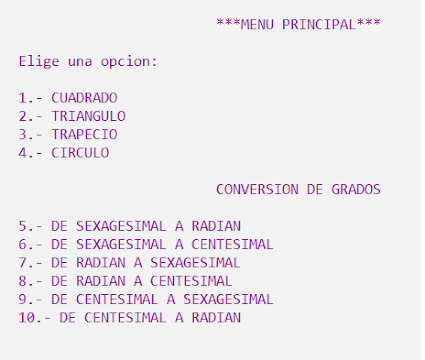

# Proyecto de Menú en C

Este proyecto es un menú interactivo desarrollado en lenguaje C, que incluye múltiples opciones de cálculo y conversión. La solución fue implementada con tres archivos principales:

- `main.c` - Contiene el código fuente.
- `main_interfaz.c` - Implementa la interfaz de usuario.
- `main_interfaz_especificaciones.c` - Incluye la interfaz y las especificaciones detalladas.

## Especificaciones

### 1. **Contraseña con 3 intentos**
   El menú requiere que el usuario ingrese una contraseña correcta para acceder a las opciones. Si el usuario falla 3 veces, el programa termina.

### 2. **Limpieza de Pantalla**
   La pantalla del menú principal se limpia después de cada selección para mantener una interfaz limpia y ordenada.

### 3. **Cambio de Colores**
   Cada opción en el menú cambia el color del fondo y de la fuente para mejorar la legibilidad. Las combinaciones de colores fueron seleccionadas para facilitar la lectura.

### 4. **Opciones del Menú**
   El menú tiene 10 opciones, las cuales incluyen:

   - **Cálculos de Áreas** (4 opciones):
     - Área de un cuadrado
     - Área de un triángulo
     - Área de un trapecio
     - Área de un círculo
     - Cada opción incluye restricciones para evitar entradas no válidas (letras, números negativos, etc.).
   
   - **Conversión de Grados** (6 opciones):
     - Conversión entre grados Celsius, Fahrenheit y Kelvin.

## Imagen de ejemplo del menú:



## Requisitos

- Compilador de C (por ejemplo, GCC).
- Sistema operativo compatible (Linux, Windows, macOS).

## Cómo Ejecutar el Proyecto

1. Clona el repositorio:
   ```bash
   git clone https://github.com/tu_usuario/tu_repositorio.git](https://github.com/golfish17/MENU.git
